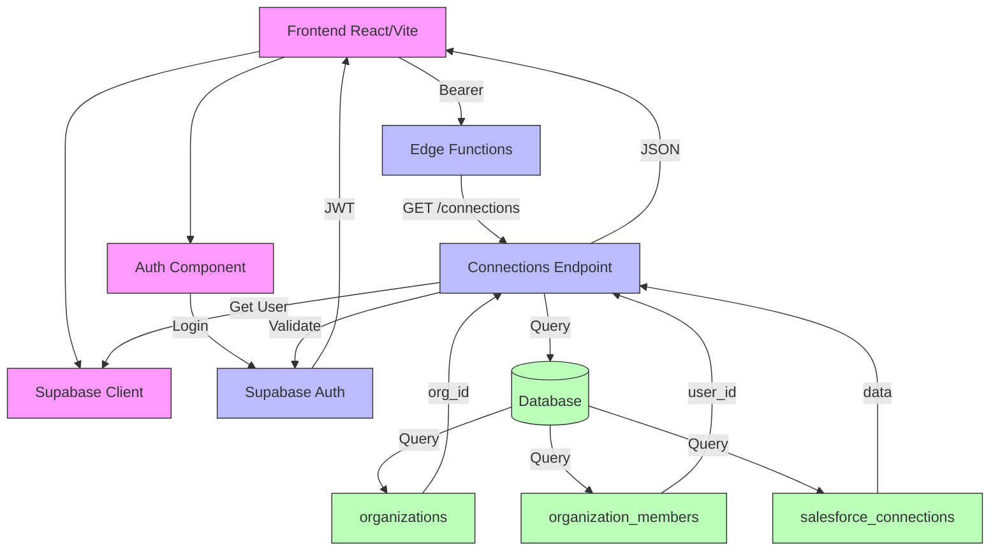

# NEXA Architecture Flow

## Current Architecture Flow Explanation

### Frontend Layer
1. **React/Vite Application**
   - Main application entry point
   - Handles routing and component rendering

2. **Auth Component**
   - Manages user authentication
   - Handles login/logout flows
   - Stores JWT token

3. **Supabase Client**
   - Manages connection to Supabase services
   - Handles API requests
   - Manages authentication state

### Backend Layer
1. **Edge Functions**
   - Hosts API endpoints
   - Processes requests
   - Manages authentication/authorization

2. **Connections Endpoint**
   - Handles GET /connections requests
   - Validates JWT tokens
   - Retrieves organization data
   - Returns Salesforce connections

### Database Layer
1. **Supabase Database**
   - Stores all application data
   - Implements Row Level Security
   - Manages relationships between entities

2. **Core Tables**
   - `organizations`: Organization data
   - `organization_members`: User-organization relationships
   - `salesforce_connections`: Salesforce org connections

### Data Flow
1. User authenticates through frontend
2. Frontend stores JWT token
3. Frontend makes API request with token
4. API validates token and user
5. API queries database for connections
6. API returns formatted response
7. Frontend displays connection data 